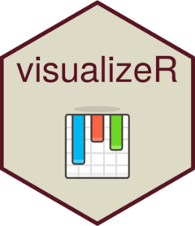

<!-- README.md is generated from README.Rmd. Please edit that file -->

```{r, include = FALSE}
knitr::opts_chunk$set(
  collapse = TRUE,
  comment = "#>",
  fig.path = "man/figures/README-",
  out.width = "100%",
  warning = FALSE,
  message = FALSE
)

desc = read.dcf('DESCRIPTION')
desc = setNames(as.list(desc), colnames(desc))
```

# `r desc$Package` 

> `r desc$Title`

`visualizeR` proposes some utils to get REACH and AGORA colors, ready-to-go color palettes, and a few visualization functions (horizontal hist graph for instance).

## Installation

You can install the last version of visualizeR from
[GitHub](https://github.com/) with:

```{r, eval = FALSE}
# install.packages("devtools")
devtools::install_github("gnoblet/visualizeR", build_vignettes = TRUE)
```

## Roadmap

Roadmap is as follows:

- [X] Add IMPACT's colors
- [X] Add all color palettes from the internal documentation
- [ ] There remains to be added more-than-7-color palettes and black color palettes
- [ ] Add new types of visualization (e.g. dumbbell plot)
- [ ] Use examples
- [ ] Add some ease-map functions
- [ ] Add some interactive functions (maps and graphs)

## Request

Please, do not hesitate to pull request any new viz or colors or color palettes, or to email request any change (guillaume.noblet@reach-initiative.org or gnoblet@zaclys.net).

## Colors 

Color palettes for REACH, AGORA and IMPACT are available. Functions to access colors and palettes are `cols_initiative()` or `pal_initiative()`. For now, the initiative with the most colors and color palettes is REACH. Feel free to pull requests new AGORA and IMPACT colors.

```{r example-colors, eval = TRUE}
library(visualizeR)

# Get all saved REACH colors, named
cols_reach(unnamed = F)[1:10]

# Extract a color palette as hexadecimal codes and reversed
pal_reach(palette = "main", reversed = TRUE, color_ramp_palette = FALSE)

# Get all color palettes names
pal_reach(show_palettes = T)
```

## Charts

### Example 1: Bar chart, already REACH themed

```{r example-bar-chart, eval = TRUE}
library(visualizeR)
library(palmerpenguins)
library(dplyr)

df <- penguins |> 
  group_by(island, species) |> 
  summarize(
    mean_bl = mean(bill_length_mm, na.rm = T),
    mean_fl = mean(flipper_length_mm, na.rm = T)) |> 
  ungroup()

# Simple bar chart by group
bar_reach(df, mean_bl, island, species, percent = FALSE, x_title = "Mean of bill length")

# Using another color palette
bar_reach(df, mean_bl, island, species, percent = FALSE, palette = "artichoke_3", legend_rev = TRUE)
```

### Example 2: Point chart, already REACH themed

At this stage, `point_reach()` only supports categorical grouping colors with the `group` arg.

```{r example-point-chart, eval = TRUE}

# Simple point chart
point_reach(penguins, bill_length_mm, flipper_length_mm)

# Point chart with grouping colors, greater dot size, some transparency, reversed color palette
point_reach(penguins, bill_length_mm, flipper_length_mm, island, alpha = 0.6, size = 3, reverse = TRUE)

# Using another color palettes
point_reach(penguins, bill_length_mm, flipper_length_mm, island, palette = "artichoke_3")
```

## Maps

```{r example-map}

# Add indicator layer 
# - based on "pretty" classes and title "Proportion (%)" 
# - buffer to add a 10% around the bounding box
map <- add_indicator_layer(
  indicator_admin1, 
  opn_dfc,
  buffer = 0.1) + 
  # Layout - some defaults - add the map title
  add_layout("% of HH that reported open defecation as sanitation facility") + 
  # Admin boundaries as list of shape files (lines) and colors, line widths and labels as vectors
  add_admin_boundaries(
    lines = list(line_admin1, border_admin0, frontier_admin0),
    colors = cols_reach("main_lt_grey", "dk_grey", "black"),
    lwds = c(0.5, 2, 3),
    labels = c("Department", "Country", "Dominican Rep. frontier"),
    title = "Administrative boundaries") + 
  # Add text labels - centered on admin 1 centroids
  add_admin_labels(centroid_admin1, ADM1_FR_UPPER) +
  # Add a compass
  add_compass() +
  # Add a scale bar
  add_scale_bar() +
  # Add credits
  add_credits("Admin. boundaries. : CNIGS \nCoord. system: GCS WGS 1984")
```

```{r map-save, eval = TRUE, include = FALSE, echo = TRUE}
tmap::tmap_save(map,
                "man/figures/README-example-map.png",
                height = 4.5,
                width = 6
                )
```


