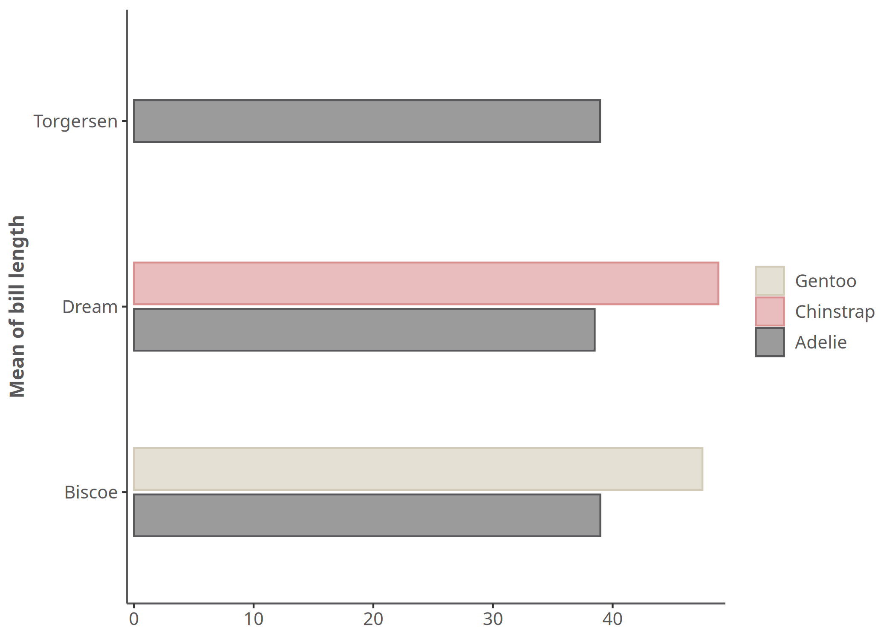
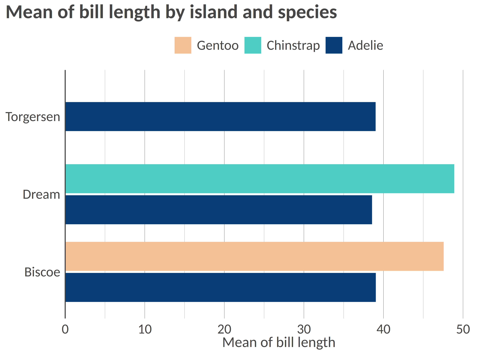
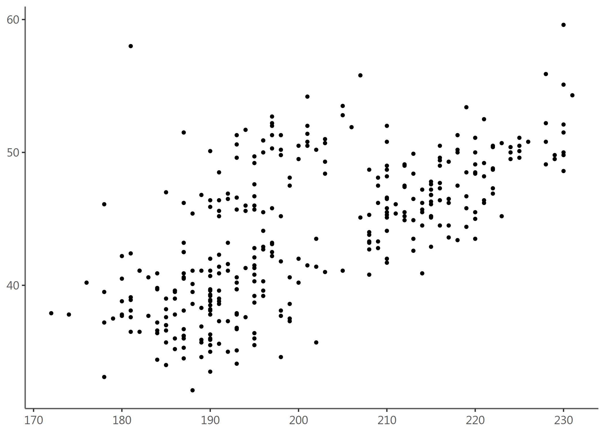
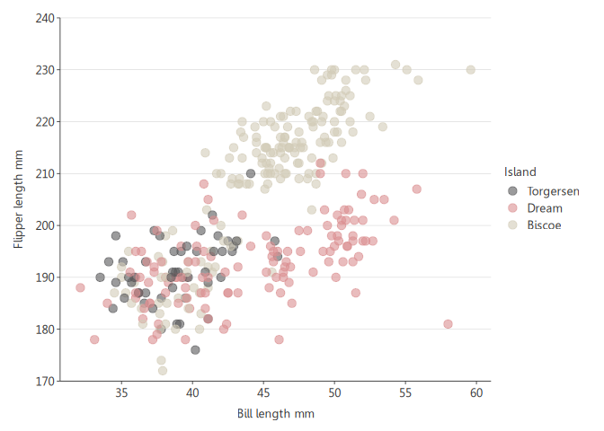
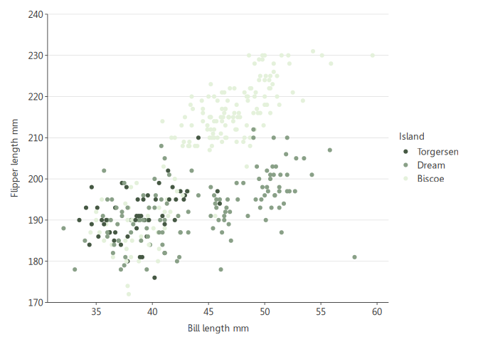

<!-- README.md is generated from README.Rmd. Please edit that file -->

# visualizeR 

> What a color! What a viz!

`visualizeR` proposes some utils to get REACH and AGORA colors,
ready-to-go color palettes, and a few visualization functions
(horizontal hist graph for instance).

## Installation

You can install the last version of visualizeR from
[GitHub](https://github.com/) with:

``` r
# install.packages("devtools")
devtools::install_github("gnoblet/visualizeR", build_vignettes = TRUE)
```

## Roadmap

Roadmap is as follows:

- [x] Add IMPACT’s colors
- [x] Add all color palettes from the internal documentation
- [ ] There remains to be added more-than-7-color palettes and black
  color palettes
- [ ] Add new types of visualization (e.g. dumbbell plot)
- [ ] Use examples
- [ ] Add some ease-map functions
- [ ] Add some interactive functions (maps and graphs)

## Request

Please, do not hesitate to pull request any new viz or colors or color
palettes, or to email request any change
(<guillaume.noblet@reach-initiative.org> or <gnoblet@zaclys.net>).

## Example 1: extracting colors

Color palettes for REACH, AGORA and IMPACT are available. Functions to
access colors and palettes are `cols_initiative()` or
`pal_initiative()`. For now, the initiative with the most colors and
color palettes is REACH. Feel free to pull requests new AGORA and IMPACT
colors.

``` r
library(visualizeR)

# Get all saved REACH colors, named
cols_reach(unnamed = F)[1:10]
#>        white        black    main_grey     main_red main_lt_grey   main_beige 
#>    "#FFFFFF"    "#000000"    "#58585A"    "#EE5859"    "#C7C8CA"    "#D2CBB8" 
#>     iroise_1     iroise_2     iroise_3     iroise_4 
#>    "#DFECEF"    "#B1D7E0"    "#699DA3"    "#236A7A"

# Extract a color palette as hexadecimal codes and reversed
pal_reach(palette = "main", reversed = TRUE, color_ramp_palette = FALSE)
#> [1] "#58585A" "#EE5859" "#C7C8CA" "#D2CBB8"

# Get all color palettes names
pal_reach(show_palettes = T)
#>  [1] "main"            "primary"         "secondary"       "two_dots"       
#>  [5] "two_dots_flashy" "red_main"        "red_main_5"      "red_alt"        
#>  [9] "red_alt_5"       "iroise"          "iroise_5"        "discrete_6"     
#> [13] "red_2"           "red_3"           "red_4"           "red_5"          
#> [17] "red_6"           "red_7"           "green_2"         "green_3"        
#> [21] "green_4"         "green_5"         "green_6"         "green_7"        
#> [25] "artichoke_2"     "artichoke_3"     "artichoke_4"     "artichoke_5"    
#> [29] "artichoke_6"     "artichoke_7"     "blue_2"          "blue_3"         
#> [33] "blue_4"          "blue_5"          "blue_6"          "blue_7"
```

## Example 2: Bar chart, already REACH themed

``` r
library(visualizeR)
library(palmerpenguins)
library(dplyr)

df <- penguins |> 
  group_by(island, species) |> 
  summarize(
    mean_bl = mean(bill_length_mm, na.rm = T),
    mean_fl = mean(flipper_length_mm, na.rm = T)) |> 
  ungroup()

# Simple bar chart by group
bar_reach(df, mean_bl, island, species, percent = FALSE, x_title = "Mean of bill length")
```



``` r

# Using another color palette
bar_reach(df, mean_bl, island, species, percent = FALSE, palette = "artichoke_3", legend_rev = TRUE)
```



## Example 3: Point chart, already REACH themed

At this stage, `point_reach()` only supports categorical grouping colors
with the `group` arg.

``` r

# Simple point chart
point_reach(penguins, bill_length_mm, flipper_length_mm)
```



``` r

# Point chart with grouping colors, greater dot size, some transparency, reversed color palette
point_reach(penguins, bill_length_mm, flipper_length_mm, island, alpha = 0.6, size = 3, reverse = TRUE)
```



``` r

# Using another color palettes
point_reach(penguins, bill_length_mm, flipper_length_mm, island, palette = "artichoke_3")
```


