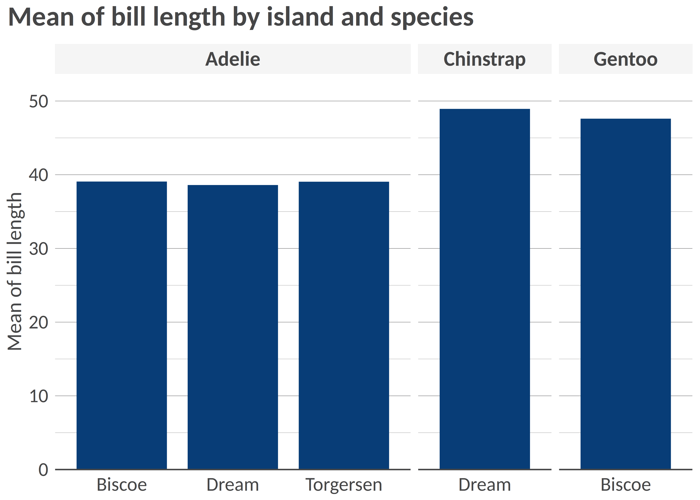
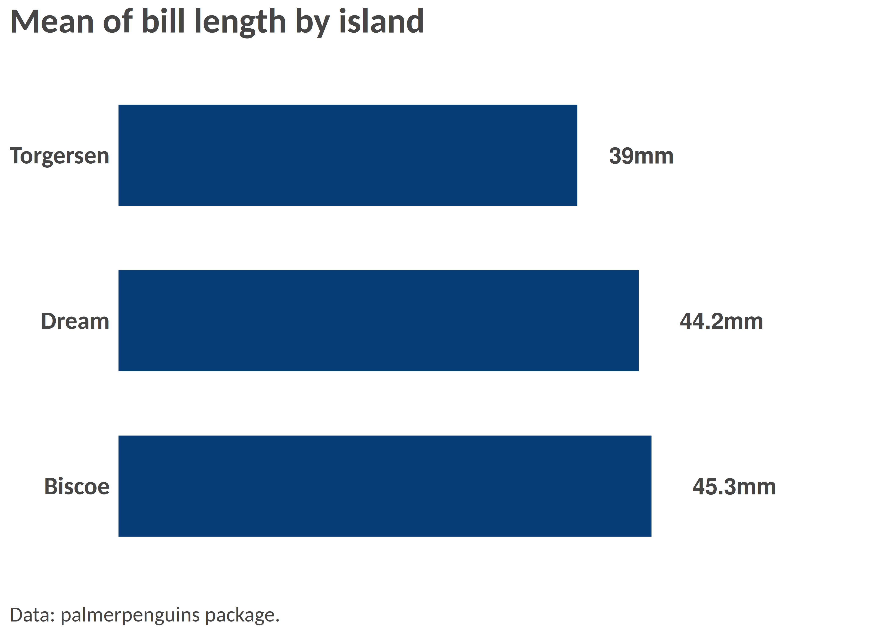

<!-- README.md is generated from README.Rmd. Please edit that file -->

# visualizeR 

> What a color! What a viz!

`visualizeR` proposes some utils to sane colors, ready-to-go color
palettes, and a few visualization functions.

## Installation

You can install the last version of visualizeR from
[GitHub](https://github.com/) with:

``` r
# install.packages("devtools")
devtools::install_github("gnoblet/visualizeR", build_vignettes = TRUE)
```

## Roadmap

Roadmap is as follows: - \[ \] Full revamp \## Request

Please, do not hesitate to pull request any new viz or colors or color
palettes, or to email request any change (<gnoblet@zaclys.net>).

## Colors

Functions to access colors and palettes are `color()` or `palette()`.
Feel free to pull request new colors.

``` r
library(visualizeR)

# Get all saved colors, named
color(unname = F)[1:10]
#>          white   lighter_grey     light_grey      dark_grey          black 
#>      "#FFFFFF"      "#F5F5F5"      "#E3E3E3"      "#464647"      "#000000" 
#> cat_2_yellow_1 cat_2_yellow_2  cat_2_light_1  cat_2_light_2  cat_2_green_1 
#>      "#ffc20a"      "#0c7bdc"      "#fefe62"      "#d35fb7"      "#1aff1a"

# Extract a color palette as hexadecimal codes and reversed
palette(palette = "cat_5_main", reversed = TRUE, color_ramp_palette = FALSE)
#> [1] "#083d77" "#4ecdc4" "#f4c095" "#b47eb3" "#ffd5ff"

# Get all color palettes names
palette(show_palettes = TRUE)
#>  [1] "cat_2_yellow"            "cat_2_light"            
#>  [3] "cat_2_green"             "cat_2_blue"             
#>  [5] "cat_5_main"              "cat_5_ibm"              
#>  [7] "cat_3_aquamarine"        "cat_3_tol_high_contrast"
#>  [9] "cat_8_tol_adapted"       "cat_3_custom_1"         
#> [11] "cat_4_custom_1"          "cat_5_custom_1"         
#> [13] "cat_6_custom_1"          "div_5_orange_blue"      
#> [15] "div_5_green_purple"
```

## Charts

### Example 1: Bar chart

``` r
library(palmerpenguins)
library(dplyr)

df <- penguins |>
  group_by(island, species) |>
  summarize(
    mean_bl = mean(bill_length_mm, na.rm = T),
    mean_fl = mean(flipper_length_mm, na.rm = T)
  ) |>
  ungroup()

df_island <- penguins |>
  group_by(island) |>
  summarize(
    mean_bl = mean(bill_length_mm, na.rm = T),
    mean_fl = mean(flipper_length_mm, na.rm = T)
  ) |>
  ungroup()

# Simple bar chart by group with some alpha transparency
bar(df, "island", "mean_bl", "species", x_title = "Mean of bill length", title = "Mean of bill length by island and species")
```


``` r

# Flipped / Horizontal
hbar(df, "island", "mean_bl", "species", x_title = "Mean of bill length", title = "Mean of bill length by island and species")
```


``` r

# Facetted
bar(df, "island", "mean_bl", "species", facet = "species", x_title = "Mean of bill length", title = "Mean of bill length by island and species", add_color_guide = FALSE)
```



``` r

#  Flipped, with text, smaller width
hbar(df = df_island, x = "island", y = "mean_bl", group = "island", title = "Mean of bill length by island", add_text = T, width = 0.6, add_text_suffix = "mm", add_text_expand_limit = 1.3, add_color_guide = FALSE)
```



### Example 2: Scatterplot

``` r
# Simple scatterplot
point(penguins, "bill_length_mm", "flipper_length_mm")
```


``` r

# Scatterplot with grouping colors, greater dot size, some transparency
point(penguins, "bill_length_mm", "flipper_length_mm", "island", group_title = "Island", alpha = 0.6, size = 3, title = "Bill vs. flipper length", , add_color_guide = FALSE)
```


``` r

# Facetted scatterplot by island
point(penguins, "bill_length_mm", "flipper_length_mm", "species", "island", "fixed", group_title = "Species", title = "Bill vs. flipper length by species and island", add_color_guide = FALSE)
```


### Example 3: Dumbbell plot

Remember to ensure that your data are in the long format and you only
have two groups on the x-axis; for instance, IDP and returnee and no NA
values.

``` r
# Prepare long data
df <- tibble::tibble(
  admin1 = rep(letters[1:8], 2),
  setting = c(rep(c("Rural", "Urban"), 4), rep(c("Urban", "Rural"), 4)),
  stat = rnorm(16, mean = 50, sd = 18)
) |>
  dplyr::mutate(stat = round(stat, 0))


# dumbbell(
#   df,
#   "stat",
#   "setting",
#   "admin1",
#   title = "% of HHs that reported open defecation as sanitation facility",
#   group_y_title = "Admin 1",
#   group_x_title = "Setting"
# )
```

### Example 4: donut chart

``` r
# Some summarized data: % of HHs by displacement status
df <- tibble::tibble(
  status = c("Displaced", "Non displaced", "Returnee", "Don't know/Prefer not to say"),
  percentage = c(18, 65, 12, 3)
)

# Donut
# donut(df,
#   status,
#   percentage,
#   hole_size = 3,
#   add_text_suffix = "%",
#   add_text_color = color("dark_grey"),
#   add_text_treshold_display = 5,
#   x_title = "Displacement status",
#   title = "% of HHs by displacement status"
# )
```

### Example 5: Waffle chart

``` r
#
# waffle(df, status, percentage, x_title = "A caption", title = "A title", subtitle = "A subtitle")
```

### Example 6: Alluvial chart

``` r
# Some summarized data: % of HHs by self-reported status of displacement in 2021 and in 2022
df <- tibble::tibble(
  status_from = c(
    rep("Displaced", 4),
    rep("Non displaced", 4),
    rep("Returnee", 4),
    rep("Dnk/Pnts", 4)
  ),
  status_to = c("Displaced", "Non displaced", "Returnee", "Dnk/Pnts", "Displaced", "Non displaced", "Returnee", "Dnk/Pnts", "Displaced", "Non displaced", "Returnee", "Dnk/Pnts", "Displaced", "Non displaced", "Returnee", "Dnk/Pnts"),
  percentage = c(20, 8, 18, 1, 12, 21, 0, 2, 0, 3, 12, 1, 0, 0, 1, 1)
)

# Alluvial, here the group is the status for 2021

# alluvial(df,
#   status_from,
#   status_to,
#   percentage,
#   status_from,
#   from_levels = c("Displaced", "Non displaced", "Returnee", "Dnk/Pnts"),
#   alpha = 0.8,
#   group_title = "Status for 2021",
#   title = "% of HHs by self-reported status from 2021 to 2022"
# )
```

### Example 7: Lollipop chart

``` r
library(tidyr)
# Prepare long data
df <- tibble::tibble(
  admin1 = replicate(15, sample(letters, 8)) |> t() |> as.data.frame() |> unite("admin1", sep = "") |> dplyr::pull(admin1),
  stat = rnorm(15, mean = 50, sd = 15)
) |>
  dplyr::mutate(stat = round(stat, 0))

# Make lollipop plot, vertical with 45 degrees angle X-labels
# lollipop(df,
#   admin1,
#   stat,
#   arrange = FALSE,
#   add_text = FALSE,
#   flip = FALSE,
#   y_title = "% of HHs",
#   x_title = "Admin 1",
#   title = "% of HHs that reported having received a humanitarian assistance"
# )
```
