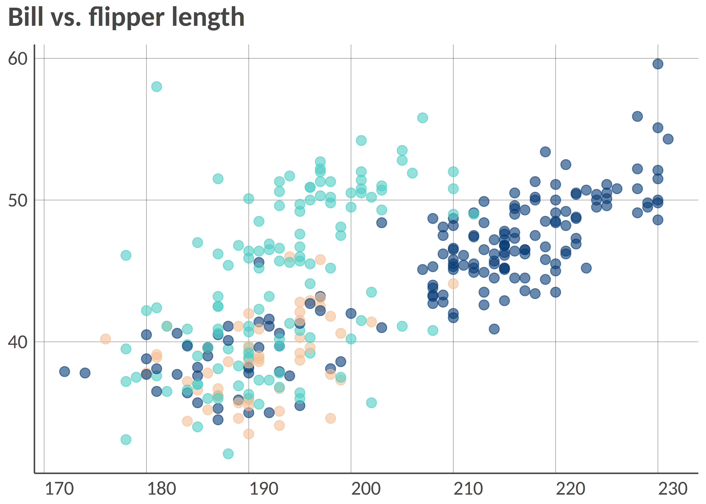
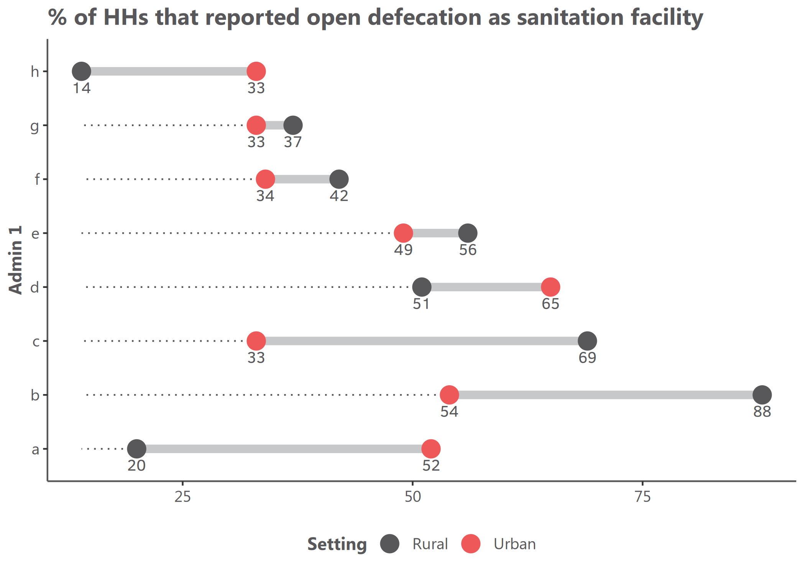

<!-- README.md is generated from README.Rmd. Please edit that file -->

# visualizeR 

> What a color! What a viz!

`visualizeR` proposes some utils to get REACH and AGORA colors,
ready-to-go color palettes, and a few visualization functions
(horizontal hist graph for instance).

## Installation

You can install the last version of visualizeR from
[GitHub](https://github.com/) with:

``` r
# install.packages("devtools")
devtools::install_github("gnoblet/visualizeR", build_vignettes = TRUE)
```

## Roadmap

Roadmap is as follows:

-   [x] Add IMPACT’s colors
-   [x] Add all color palettes from the internal documentation
-   [ ] There remains to be added more-than-7-color palettes and black
    color palettes
-   [ ] Add new types of visualization (e.g. dumbbell plot)
-   [ ] Use examples
-   [ ] Add some ease-map functions
-   [ ] Add some interactive functions (maps and graphs)

## Request

Please, do not hesitate to pull request any new viz or colors or color
palettes, or to email request any change
(<guillaume.noblet@reach-initiative.org> or <gnoblet@zaclys.net>).

## Colors

Color palettes for REACH, AGORA and IMPACT are available. Functions to
access colors and palettes are `cols_initiative()` or
`pal_initiative()`. For now, the initiative with the most colors and
color palettes is REACH. Feel free to pull requests new AGORA and IMPACT
colors.

``` r
library(visualizeR)

# Get all saved REACH colors, named
cols_reach(unnamed = F)[1:10]
#>        white        black    main_grey     main_red main_lt_grey   main_beige 
#>    "#FFFFFF"    "#000000"    "#58585A"    "#EE5859"    "#C7C8CA"    "#D2CBB8" 
#>     iroise_1     iroise_2     iroise_3     iroise_4 
#>    "#DFECEF"    "#B1D7E0"    "#699DA3"    "#236A7A"

# Extract a color palette as hexadecimal codes and reversed
pal_reach(palette = "main", reversed = TRUE, color_ramp_palette = FALSE)
#> [1] "#58585A" "#EE5859" "#C7C8CA" "#D2CBB8"

# Get all color palettes names
pal_reach(show_palettes = T)
#>  [1] "main"            "primary"         "secondary"       "two_dots"       
#>  [5] "two_dots_flashy" "red_main"        "red_main_5"      "red_alt"        
#>  [9] "red_alt_5"       "iroise"          "iroise_5"        "discrete_6"     
#> [13] "red_2"           "red_3"           "red_4"           "red_5"          
#> [17] "red_6"           "red_7"           "green_2"         "green_3"        
#> [21] "green_4"         "green_5"         "green_6"         "green_7"        
#> [25] "artichoke_2"     "artichoke_3"     "artichoke_4"     "artichoke_5"    
#> [29] "artichoke_6"     "artichoke_7"     "blue_2"          "blue_3"         
#> [33] "blue_4"          "blue_5"          "blue_6"          "blue_7"
```

## Charts

### Example 1: Bar chart, already REACH themed

``` r
library(visualizeR)
library(palmerpenguins)
library(dplyr)

df <- penguins |> 
  group_by(island, species) |> 
  summarize(
    mean_bl = mean(bill_length_mm, na.rm = T),
    mean_fl = mean(flipper_length_mm, na.rm = T)) |> 
  ungroup()

# Simple bar chart by group with some alpha transparency
bar(df, island, mean_bl, species, percent = FALSE, alpha = 0.6, x_title = "Mean of bill length")
```


``` r
# Using another color palette through `theme_reach()` and changing scale to percent
bar(df, island,mean_bl, species, percent = TRUE, theme = theme_reach(palette = "artichoke_3"))
```


``` r
# Not flipped, with text added, group_title, no y-axis and no bold for legend
bar(df, island, mean_bl, species, group_title = "Species", flip = FALSE, add_text = TRUE, add_text_suffix = "%", percent = FALSE, theme = theme_reach(text_font_face = "plain", axis_y = FALSE))
```


### Example 2: Point chart, already REACH themed

At this stage, `point_reach()` only supports categorical grouping colors
with the `group` arg.

``` r
# Simple point chart
point(penguins, bill_length_mm, flipper_length_mm)
```


``` r
# Point chart with grouping colors, greater dot size, some transparency, reversed color palette
point(penguins, bill_length_mm, flipper_length_mm, island, alpha = 0.6, size = 3, theme = theme_reach(reverse = TRUE))
```



``` r
# Using another color palettes
point(penguins, bill_length_mm, flipper_length_mm, island, size = 1.5, x_title = "Bill", y_title = "Flipper", title = "Length (mm)", theme = theme_reach(palette = "artichoke_3", text_font_face = , grid_x = T,  title_position_to_plot = FALSE))
```


### Example 3! Dumbbell plot, REACH themed

Remember to ensure that your data are in the long format and you only
have two groups on the x-axis; for instance, IDP and returnee and no NA
values.

``` r
# Prepare long data
df <- tibble::tibble(
  admin1 = rep(c("A", "B", "C", "D", "E", "F", "G", "H"), 2),
  setting = c(rep(c("Rural", "Urban"), 4), rep(c("Urban", "Rural"), 4)),
  stat = rnorm(16, mean = 50, sd = 18)
) |>
  dplyr::mutate(stat = round(stat, 0))

# Example
dumbbell(df,
         stat,
         setting,
         admin1,
         title = "% of HHs that reported open defecation as sanitation facility",
         group_y_title = "Admin 1",
         theme = theme_reach(legend_position =  "bottom",
                             legend_direction = "horizontal",
                             palette = "primary",
                             title_position_to_plot = FALSE))
```



## Maps

``` r
# Add indicator layer 
# - based on "pretty" classes and title "Proportion (%)" 
# - buffer to add a 10% around the bounding box
map <- add_indicator_layer(
  indicator_admin1, 
  opn_dfc,
  buffer = 0.1) + 
  # Layout - some defaults - add the map title
  add_layout("% of HH that reported open defecation as sanitation facility") + 
  # Admin boundaries as list of shape files (lines) and colors, line widths and labels as vectors
  add_admin_boundaries(
    lines = list(line_admin1, border_admin0, frontier_admin0),
    colors = cols_reach("main_lt_grey", "dk_grey", "black"),
    lwds = c(0.5, 2, 3),
    labels = c("Department", "Country", "Dominican Rep. frontier"),
    title = "Administrative boundaries") + 
  # Add text labels - centered on admin 1 centroids
  add_admin_labels(centroid_admin1, ADM1_FR_UPPER) +
  # Add a compass
  add_compass() +
  # Add a scale bar
  add_scale_bar() +
  # Add credits
  add_credits("Admin. boundaries. : CNIGS \nCoord. system: GCS WGS 1984")
```


